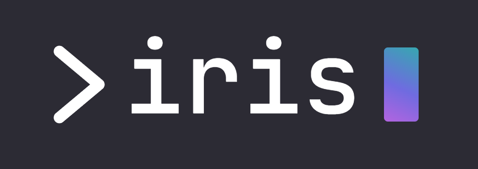

<div align="center">
  <a href="https://github.com/xoai/iris">
    <picture>
      
    </picture>
  </a>
  <h1>IRIS</h1>
  <h3>A portable runtime for durable AI agents</h3>
</div>

<p align="center">
  <a href="https://www.npmjs.com/package/iris-runtime"></a>
  <a href="https://nodejs.org"></a>
  
  
  <a href="LICENSE"></a>
</p>

Iris is a portable runtime for durable AI agents — built so an agent is never locked to a single host, model, or vendor. You declare an agent as a config file plus a folder — instructions and skills as files, tools and channels referenced by address — and `iris build` compiles it into an open, content-addressed image: the unit you version, push to any OCI registry, and run anywhere.

**[Features](#key-features)** · **[When to use](#when-to-use-iris)** · **[Compare](#how-iris-compares)** · **[Authoring](#the-agent-is-a-directory)** · **[Install](#install)** · **[Quick start](#quick-start)** · **[How it works](#how-it-works)** · **[Packages](#whats-inside)**

> **New here?** This README is the manifesto — *why* Iris exists. For a guided
> path from `npx iris-runtime init` to a deployed, talkable agent, follow the
> **[docs funnel](docs/README.md)** in order.

## Key features

- **Pause and resume anywhere** — one agent image runs on a laptop, a VPS, a serverless function, or an edge isolate. Stop a session on one and resume it on another, mid-task.
- **You own the state, not the host** — the agent's progress lives in Iris's log, not in a host's memory. The same journal / replay / snapshot code runs everywhere; a host only has to store bytes and wake the agent up.
- **It can't silently drift** — replaying the log always rebuilds the exact same state, and Iris checks this on every step. If a crash interrupts an action, recovery retries it safely (at-least-once with idempotency) — never twice.
- **Config, not code** — describe the agent in a small `Agentfile` (JSON or YAML). Tools live outside the agent and are referenced by address (MCP / gRPC / subprocess), so they can be written in any language and run on any host.
- **Ships like a Docker image** — `iris build` produces a content-addressed image you can `inspect` and `verify`, then **push to any OCI registry and pull and run anywhere**.
- **Talk to it, deploy it in one command** — a built-in web chat UI (`iris serve --web`) and a small isomorphic client SDK (`@irisrun/client-sdk`) put a human in front of the agent, and `iris deploy` lands it on a real edge host (Cloudflare Durable Objects), where a tab close or a host migration resumes the same session.
- **Bring your own model** — the model call is just another recorded step behind a small adapter. Anthropic and OpenAI adapters ship (both pass one shared conformance suite); others drop in. No provider is baked into the core.
- **A small, safe core you can extend** — a thin kernel enforces the safety rules; the agent's decisions (when to summarize context, when to stop, when to ask a human) are pluggable, and every choice is recorded so replay stays exact.
- **Secure by default** — tools run sandboxed with networking denied by default, and credentials are brokered so secrets never enter the sandbox. Real per-host allowlist egress + brokering for the docker backend ride a host-side sidecar egress proxy.

## When to use Iris

Reach for Iris when an agent's *state* is the hard part:

- **Long-running tasks that must survive restarts and deploys.** A multi-hour job parks on a timer or an approval and resumes — across a process restart, a redeploy, or days later — exactly where it left off.
- **Human-in-the-loop workflows.** A turn pauses on an approval gate and the session waits durably until the human responds; no held connection, no lost context.
- **Moving an agent across environments.** Start a session on a dev laptop and resume it on a VPS, a serverless function, or an edge isolate — same image, same journal, byte-identical behavior.
- **Agents you need to audit or replay.** Every step is journaled, so you can inspect the exact decision/effect timeline, derive traces, and re-run a session deterministically.

If your agent is a short, stateless request → response call, you don't need Iris — its value is durability and portability of *state*.

## How Iris compares

Iris's two neighbors each made one simplifying trade. **Docker Agent** keeps agents portable by keeping them *stateless*. **Eve** keeps agents *stateful* by binding them to one opinionated host. Iris takes the unclaimed corner — **stateful *and* portable** — and pays for it by owning the durability engine.

| | Docker Agent | Eve | Iris |
|---|---|---|---|
| **Packages** | stateless agents | stateful agents | **stateful agents — *and* portable** |
| **A session is** | an ephemeral process | bound to its host | **a journal + a pinned image digest — data, not a process** |
| **Runs on** | any OCI host (statelessly) | one opinionated host | **any host with two narrow ports** — VPS · serverless · edge · in-memory |
| **Pause here, resume elsewhere** | n/a — stateless | n/a — host-bound | **✅ cross-host, byte-identical resume** |
| **Durability engine** | none | framework/host-native | **owned by Iris — the same journal/replay/snapshot code on every host** |
| **Deterministic replay** | — | — | **✅ a pure function of the journal, asserted on every step** |
| **Authoring** | declarative YAML | filesystem + TypeScript | **declarative Agentfile (JSON/YAML) — behavior referenced, never embedded** |
| **Tools** | MCP servers + built-ins | typed TypeScript functions | **referenced across a protocol boundary (MCP / gRPC / subprocess) — any language** |
| **Distribution** | OCI image — push/pull anywhere | project / host deploy | **content-addressed OCI image — push/pull anywhere; sessions migrate too** |
| **Recovery** | — | host-managed | **at-least-once + idempotency, checkpoint-before-effect** |

<sub>— marks a property outside that project's design center, not necessarily a hard limitation.</sub>

> Iris = Docker's portability + Eve's durability — minus both their trades.

## The agent is a directory

`iris init` scaffolds a project; `iris build` compiles it into an image.

```text
my-agent/
├── agent.json          # the Agentfile — declarative manifest (agent.yaml also works)
├── instructions.md     # the always-on system prompt (embedded by hash at build)
└── skills/             # procedures loaded on demand (embedded by hash)
    └── triage.md
```

Tools and connections aren't local files — the manifest **references** them by URI (`mcp://`, `grpc://`, `subprocess://`), because behavior lives across a protocol boundary, free to be written in any language:

```json
{
  "apiVersion": "iris/v1",
  "kind": "Agent",
  "name": "my-agent",
  "model": "anthropic/claude-x",
  "instructions": "./instructions.md",
  "skills": ["./skills/triage.md"],
  "tools": [{ "ref": "mcp://search" }, { "ref": "grpc://billing@^2" }],
  "connections": [{ "ref": "mcp://crm" }],
  "harness": {
    "bundle": "default",
    "tactics": { "decideNext": "iris/tool-loop@^1" }
  },
  "requires": {
    "tool_locality": "remote",
    "long_running": true
  },
  "sandbox": {
    "backend": "inmemory",
    "network": "deny-all"
  }
}
```

`build` validates loudly: an unknown `apiVersion`/`kind`, an inline-behavior field (`code`/`script`/`source`), or an unrecognized ref scheme is rejected (`subprocess://` also requires `local_subprocess: true` and rules out `tool_locality: "remote"`). The whole contract ships as a JSON Schema (draft 2020-12) — run **`iris schema`** for the authoritative field reference, editor autocomplete, and CI validation.

<details>
<summary><b>Every Agentfile field</b></summary>

| Field | Required | Values / form | What it does |
|---|---|---|---|
| `apiVersion` | yes | `"iris/v1"` | Schema version (only value today). |
| `kind` | yes | `"Agent"` | Manifest kind. |
| `name` | yes | string | The agent's name. |
| `model` | yes | `"<provider>/<model>"` | What the `model_call` performer resolves, e.g. `anthropic/claude-x`. |
| `instructions` | yes | path | Always-on system prompt — **content embedded by hash** at build. |
| `skills` | yes (may be `[]`) | path[] | Procedures loaded on demand; embedded by hash. |
| `tools` | yes (may be `[]`) | `{ ref }[]` | Tool contracts referenced by URI — `mcp://`, `grpc://`, or `subprocess://` (version range allowed, e.g. `@^2`). Pinned by digest. |
| `connections` | yes (may be `[]`) | `{ ref }[]` | Long-lived connections; same ref schemes as `tools`. |
| `harness.bundle` | no | bundle ref | The tactic bundle — `"default"`, or a domain bundle (e.g. the coding bundle). |
| `harness.tactics` | no | `{ seam: ref }` | Per-seam tactic overrides (seams include `assembleContext`, `decideNext`, `onToolError`, `shouldCompact`, `gateAction`). |
| `requires.tool_locality` | no | `in-process` \| `local` \| `remote` | Where tools may run; checked against the host at deploy. |
| `requires.long_running` | no | bool | Needs a host that holds a live process. |
| `requires.local_subprocess` | no | bool | Must be `true` for any `subprocess://` tool. |
| `requires.filesystem` | no | bool | Needs host filesystem access. |
| `requires.websockets` | no | bool | Needs WebSocket channels. |
| `sandbox.backend` | yes | `inmemory` \| `docker` | Sandbox backend for tool execution. |
| `sandbox.network` | yes | e.g. `deny-all` | Network policy floor. |
| `sandbox.workspace` | no | path | A workspace directory, embedded by hash. |

</details>

`iris build` resolves those refs, embeds content by hash, pins everything in a lockfile, and emits a content-addressed OCI layout — the thing you push, pull, and run:

```text
image/                  # OCI layout — push/pull anywhere
├── oci-layout
├── index.json          # → image manifest, addressed by digest
└── blobs/sha256/…      # Agentfile + instructions + skills + lockfile, each pinned
```

Both JSON and a strict YAML subset compile to the **same deterministic `imageDigest`**. A live session **holds** its pinned digest — redeploying the image never silently changes a running session; the only sanctioned change is a definition migration.

## Install

**Requires [Node.js](https://nodejs.org) ≥ 24.** No build step, zero runtime dependencies.

```sh
# run it without installing anything
npx iris-runtime init my-agent

# …or install the `iris` command globally
npm i -g iris-runtime
iris init my-agent
```

The npm package is **`iris-runtime`**; the installed binary is **`iris`**. For a real model call, set a key — omit it and Iris uses a built-in deterministic fake:

```sh
export ANTHROPIC_API_KEY=sk-ant-...
```

Then head to the **[Quick start](#quick-start)**.

<details>
<summary><b>Running from source (contributors)</b></summary>

TypeScript runs directly via Node's native type-stripping — no build step. From a clone of the repo:

```sh
npm install        # links the local workspaces (offline)
npm test           # 626 passing (+6 live-conformance tests gated on API keys)
npm run typecheck  # tsc --noEmit — clean
# run the CLI straight from source, no install:
node --conditions=iris-src packages/cli/src/cli-main.ts <cmd>
```

Use the glob form `node --test 'tests/**/*.test.ts'` (a bare directory fails on Node 24); `node:sqlite` prints a cosmetic `ExperimentalWarning`. The published packages are compiled to JS because Node won't type-strip `.ts` under `node_modules` (see [`RELEASING.md`](RELEASING.md)).
</details>

## Quick start

From nothing to a running, resumable agent in **three steps** — no build step, no config, no API key required.

**1 · Scaffold a project**

```sh
npx iris-runtime init ./my-agent
```

Drops a self-contained agent on disk: `agent.json` + `instructions.md` + a working bundled `now` tool.

**2 · Build it into an image**

```sh
iris build --file ./my-agent/agent.json --out ./image
# → {"imageDigest":"sha256:…"}
```

`build` resolves and hashes everything into a content-addressed OCI image — the single unit you version, push to any registry, and run anywhere.

**3 · Talk to it**

```sh
iris chat ./image --session s1 --db /tmp/s1.sqlite --fake
```

`--fake` uses a deterministic echo model, so this runs with **no API key**. The conversation *is* the session journal: leave with `/exit`, rerun the exact same command, and the chat resumes where you left off.

> **Want a real model?** `export ANTHROPIC_API_KEY=sk-ant-…` then drop `--fake`.

That's the core loop. The rest of the command surface is below.

<details>
<summary><b>The full lifecycle — every command</b></summary>

`init → build → inspect → schema → verify → run → serve/chat → deploy`

```sh
iris init    ./my-agent                                   # scaffold a project: agent.json + instructions.md + a bundled `now` tool
iris build   --file ./my-agent/agent.json --out ./image   # → {"imageDigest":"sha256:…"}
iris inspect ./image                                      # read the image at the intent level
iris schema  > agentfile.schema.json                      # emit the Agentfile JSON Schema (draft 2020-12) for editor/CI
iris verify  ./image                                      # loud failure on any tamper or pin mismatch
iris run     ./image --session s1 --db /tmp/s1.sqlite     # run one turn (real model call — needs ANTHROPIC_API_KEY)
iris serve   ./image --port 8787 --web                    # HTTP server: REST + SSE + WS streaming, + a web chat UI at /
iris chat    ./image --session s1 --db /tmp/s1.sqlite     # durable, resumable, streaming chat
iris deploy  ./image --out ./iris-edge                    # scaffold a Cloudflare Worker + Durable Object for edge deploy
```

`audit`, `eval`, and `schedule` round out the surface.

**Running from a clone** (no published package, no build step) — swap `iris` for the source bin:
`node --conditions=iris-src packages/cli/src/cli-main.ts <cmd> …`

</details>

### Chat with it

A terminal REPL where you talk to the agent turn-by-turn. Replies **stream live**, token by token. Because the conversation *is* the journal, a brand-new process resumes the same chat — earlier turns are not re-streamed.

```sh
# No key needed — --fake is the deterministic echo model.
printf 'hello\nwhat can you do?\n/exit\n' \
  | iris chat ./image --session s1 --db /tmp/s1.sqlite --fake
# agent> echo:hello              ← streamed token-by-token
# agent> echo:what can you do?

# A BRAND-NEW process resumes the SAME conversation:
printf 'still there?\n/exit\n' \
  | iris chat ./image --session s1 --db /tmp/s1.sqlite --fake
# agent> echo:still there?       ← turn 3; earlier turns are NOT re-streamed
```

- **Real model** — drop `--fake`, set `ANTHROPIC_API_KEY`. A provider error surfaces as the reply, never poisons the session.
- **Durability** — `--db :memory:` for throwaway, a file path to persist.
- **Human-in-the-loop** — at an irreversible tool, chat parks and asks inline (`approve? [y/n]`), recorded as a journaled, replayable decision ([governance](docs/07-governance.md)).

### Serve it over HTTP

One command turns the image into an HTTP server — buffered REST plus a **live token stream** over SSE or WebSocket. Defaults to the no-key echo model; add `--model anthropic` + `ANTHROPIC_API_KEY` for the real provider.

```sh
iris serve ./image --port 8787
# → listening on http://127.0.0.1:8787 (model=echo)

# Stream a turn as Server-Sent Events:
curl -N -H 'accept: text/event-stream' -H 'content-type: application/json' \
  -d '{"messages":[{"role":"user","content":"hello"}]}' \
  http://127.0.0.1:8787/v1/session
# event: delta    data: {"type":"delta","text":"echo:"}
# event: outcome  data: {"type":"outcome","status":"parked","continuationToken":"…"}
```

Drop the `Accept` header for one buffered JSON reply, or hold a whole conversation over one WebSocket at `ws://…/v1/ws`. To continue a session, present the rotated single-use `continuationToken` — a stale or missing one is refused loudly (4xx), never a silent 200.

### Resume on a *different* host

The install-free portability proof: the **same image** starts on host A (sqlite, long-running), parks at a human-in-the-loop boundary, and resumes on host B (serverless-style, no held process) — same journal, byte-identical output.

```sh
node tests/manual/portability-demo.ts        # prints the proof, exits 0 on PASS
```

```text
① host A (vps-sqlite): turn ran → parked on HITL
② host A crossed a real snapshot+truncate boundary — migration is non-vacuous
③ migrateSession A→B: snapshot + journal tail copied to serverless-fs (port-only)
④ host B (serverless-fs): resumed from the SAME journal → finished (assertion green)
⑤ host-B state + output are BYTE-IDENTICAL to a single-host control
```

Regression-locked by `tests/cross-host-resume.test.ts`.

## Where a session can run

The same image runs on any host that implements the two ports. Each adapter enforces the *same* CAS / fencing / high-water-mark / snapshot invariants — only the storage and wakeup mechanics differ. A session can be `migrateSession`'d between any two of them and resumes byte-identically.

| Host target | Package | Shape | Wakeup |
|---|---|---|---|
| **VPS / long-running** | `@irisrun/store-sqlite` | One process holds the DB handle | SQLite durable timer |
| **Serverless** | `@irisrun/store-fs` | Cold per turn — no held process; a fresh instance over the same root resumes | filesystem timer (O_EXCL) |
| **Edge isolate** | `@irisrun/store-do` | Cold Durable-Object isolate per turn | DO alarm |
| **In-memory** | `@irisrun/store-memory` | Unit/test store + store **B** for cross-store resume | in-memory timer |

`@irisrun/host` adds the deploy gate: an Agentfile declares what it `requires`; a host declares its `capabilities`; an over-capable request is refused **loudly** at deploy, never silently downgraded.

## How it works

```text
                               client
                                  │
                                  ▼
┌────────────────  channel · REST · SSE · WS · MCP  ─────────────────┐
└─────────────────────────────────┬──────────────────────────────────┘
                                  ▼
╔══════════════════════  @irisrun/core · pure  ══════════════════════╗
║  harness kernel → seams → tactics  (default / coding bundle)       ║
║  effect engine → checkpoint-before-effect                          ║
║  journal → replay + always-on assertion → snapshot                 ║
╚════════════════╤══════════════════════════════════╤════════════════╝
                 │ StateStore (CAS + fencing)       │ Scheduler (wakeup)
                 ▼                                  ▼
┌────────────────────────────────────────────────────────────────────┐
│  host adapters    sqlite · fs · durable-objects · memory           │
└────────────────────────────────────────────────────────────────────┘

   channel protocol:  stable sessionId  +  single-use continuationToken (rotated per turn)
   tools across a protocol boundary:  in-process · subprocess · mcp · grpc
```

- **Durability engine.** An append-only journal of *effects* and *decisions* is the single source of truth. Each effect is checkpointed before it runs and read back on replay (a deterministic `effectId` means a recovered crash applies it at most once). The `StateStore` port is compare-and-swap + fencing, so only one writer ever wins; snapshots periodically materialize state and truncate the journal to keep replay cost bounded.
- **Tools across a protocol boundary.** A tool's **contract** (name + schema + transport) is its stable, model-visible identity, pinned by digest; the implementation floats behind it, in any language. Transports ship for in-process, `subprocess://`, `mcp://` (stdio JSON-RPC), and `grpc://` (http2 + JSON). Only an explicitly retry-safe tool gets an idempotency key, so recovery never double-writes.
- **Pluggable harness.** Each seam consultation *is* a journaled effect (`{seam, tacticId, choice}`), so a tactic can be nondeterministic or third-party and replay still cannot diverge. The **default bundle** covers most agents; `@irisrun/bundle-coding` adds coding-specialized tactics.
- **Channels & observability.** A channel owns the two-identifier protocol — a stable `sessionId` plus a single-use `continuationToken` rotated every turn — and streams a turn live over SSE or WebSocket (`iris serve`; `--web` adds the chat UI). `@irisrun/inspect`, `@irisrun/observe`, and `@irisrun/evals` are read-only journal derivations (timeline, OTel spans, reproducible evals), so they can't affect determinism.

## What's inside

A monorepo (npm workspaces). The **pure core** imports nothing host/transport/Node-specific; everything else is a host-side adapter or tool, each with **zero external dependencies**.

| Package | Role |
|---|---|
| `@irisrun/core` | The pure durability core — journal, the two ports, replay + the always-on assertion, the effect engine, lease/fencing, recovery, snapshot/`migrateSession`, **and** the harness kernel + seams + `defaultBundle`. |
| `@irisrun/store-sqlite` · `@irisrun/store-fs` · `@irisrun/store-memory` · `@irisrun/store-do` | The four host adapters — long-running (sqlite), serverless (fs, O_EXCL), in-memory, and edge (Durable Objects). |
| `@irisrun/host` | `HostAdapter` + `runTurnOn` + the capability-diff deploy gate. |
| `@irisrun/agent` | The image toolchain — Agentfile parse/validate, resolve/embed/pin, deterministic `imageDigest`, OCI layout, loud `verify`, session pinning + definition migration. |
| `iris` | The CLI (`iris` binary): `init / build / inspect / schema / verify / push / pull / run / serve / chat / deploy / audit / eval / schedule`. `serve` boots the HTTP server (`--policy` governance, `--web` chat UI); `chat` resolves approval gates inline; `audit` / `eval` / `schedule` add compliance, reproducible evals, and recurring jobs. |
| `@irisrun/tools` | The tool boundary — contract + digest, the uniform invoker, in-process/subprocess/MCP/gRPC transports, the retry-safe `tool_call` performer. |
| `@irisrun/sandbox` | The security floor — deny-all network + credential brokering + a host-side sidecar egress proxy (real per-host allowlist egress). inmemory (unit) + docker (manual smoke). |
| `@irisrun/channel-rest` · `@irisrun/channel-mcp` | Durable, replay-safe sessions over a wire — REST over `node:http` with live **SSE** and hand-rolled zero-dep **WebSocket** streaming of a turn (records + model token deltas), the rotated single-use continuation token, and the agent exposed *as* an MCP server. |
| `@irisrun/channel-web` · `@irisrun/client-sdk` | Durable, resumable sessions in front of a human — a zero-dep web chat UI (`iris serve --web`, persists the session so a tab close/reload resumes it) and a thin **isomorphic** client SDK that holds only a session handle, so a fresh process resumes the same session over the serve SSE protocol. |
| `@irisrun/bundle-coding` | The first domain tactic bundle — coding-specialized seam tactics. |
| `@irisrun/inspect` · `@irisrun/observe` · `@irisrun/evals` | Read-only journal derivations — timeline viewer, OTel spans, reproducible-eval arbiter. |
| `@irisrun/provider-anthropic` · `@irisrun/provider-openai` | Vendor-neutral, replay-safe model adapters — direct Anthropic Messages and OpenAI Chat Completions `model_call` performers via built-in `fetch`; the provider is chosen from the model-id prefix (`anthropic/…`, `openai/…`), swappable without touching the agent, and both pass one shared conformance suite. |
| `@irisrun/auth` | A journaled, replayable approval audit you own — principal identity and a declarative who-may-approve policy on the existing approval gate, with every decision in the same event log as model calls and tool effects (`makeGovernedApprovalPerformer`). Wired into `iris serve --policy`. |
| `@irisrun/audit` | Whole-session compliance audit — the full retained journal + a completeness check and an offline replay-verified verdict; drives `iris audit`. |
| `@irisrun/subagents` · `@irisrun/schedule` | Breadth on the journaled substrate — durable **delegation** to a child agent (its output journaled in the parent, so the parent replays without re-running it) and **recurring jobs** that park on durable timers between runs. Both replayable. |
| `@irisrun/demo` | The no-model counter machine that parks and resumes across a restart. |

## Tested & proven

The unit suite is **install-free, deterministic, zero-dependency** — **626 passing** on Node 24 (plus **6** live-provider conformance tests gated on API keys), `tsc --noEmit` clean. Every claim in this README is regression-locked: CAS + fencing, park/resume across a forced restart, replay purity (the always-on assertion catches injected nondeterminism; `IRIS_ASSERT=0` turns it off), the crash matrix (at-least-once, never double-applied), a **10,000-session** determinism run, cross-store and **cross-host** resume, a **chaos/concurrency suite** that stresses contention, a simulated partition, and redeploy-recovery against the **real fs + sqlite backends**, an **adversarial sandbox-egress** [threat model](docs/security-sandbox-threat-model.md) (bypass + secret-leak attempts), **provider canonicalization** + **model-call record-replay fidelity**, deterministic image digest + loud verify, the single-use-token channel discipline, and the SSE/WebSocket streaming layer.

Real *egress* — OCI pushes, live Anthropic calls, `wrangler deploy` / Lambda upload, `npm publish`, OTLP export — stays **env-gated** as manual smokes under `tests/manual/`, outside the suite.

```sh
npm test                                 # the whole suite → 626 passing (6 live-conformance tests gated on API keys)
node tests/manual/portability-demo.ts          # the cross-host proof (install-free)
node tests/manual/serverless-deploy-smoke.ts   # real Cloudflare DO / Lambda (gated)
IRIS_SERVE_SMOKE=1 node tests/manual/serve-streaming-smoke.ts  # real serve: REST + SSE + WS (gated)
IRIS_PACK_SMOKE=1 node tests/manual/npm-pack-smoke.ts          # npx iris-runtime init (gated)
```

Iris is **early** — `0.1.0`, [published on npm](https://www.npmjs.com/package/iris-runtime), public API still in flux — but the architecture and the install-free local/test path are production-minded. Cutting a release is gated (`IRIS_PUBLISH=1 npm run release`; see [`RELEASING.md`](RELEASING.md)).

## License

[MIT](LICENSE) © 2026 xoai
